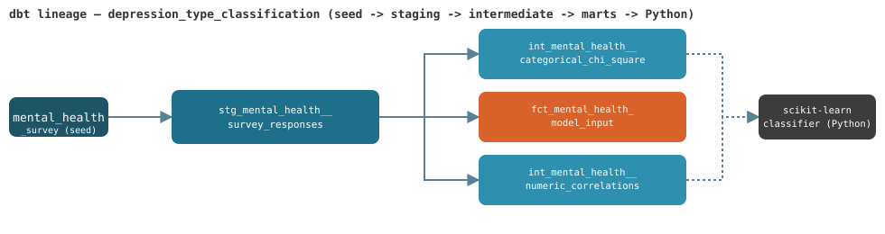

# Predicting Depression Type from Lifestyle & Behavioural Factors

**Team (Group 9, Statistics for Data Science course, University of Waterloo WATSPEED Data Science Certificate):** Nan Zhou, Richard Sarzynski, Emily Gomolka, Bruno Pinto, Parmis Jahanbani, Iqbal Bamrah

## Problem

Depression isn't one condition: this dataset labels 12 distinct types, from "no clinically significant" through mild, moderate, and severe depression to dysthymia, seasonal affective, postpartum, bipolar-related, reactive, and psychotic depression. The goal was to test whether lifestyle and behavioural survey data (sleep, social media use, coping methods, support access, etc.) combined with psychological indicators could predict which type a respondent falls into. Just as important was reasoning carefully about *why* one modeling approach would outperform another given the structure of the data, rather than just reporting whichever model scored higher.

The project was later extended with a tested data pipeline (dbt + DuckDB) and orchestration (Apache Airflow), so the classifier only ever trains on data that has passed quality checks.

## Data

- **Source:** [Mendeley Data: Mental Health Dataset (Choudhury, 2022)](https://data.mendeley.com/datasets/xppzm3kv9g/2)
- 1,998 observations, 21 variables, 12 target classes (`Depression_Type`), 0 missing values, 0 duplicate rows.
- Variables span numerical (age, sleep hours, social media hours), ordinal (low energy, low self-esteem, nervousness, overeating level, depression score), and nominal categorical (gender, education, employment, symptoms, coping methods, self-harm, suicide attempts, etc.). Each type is analyzed with an appropriate statistical method rather than treated as generic numeric input.
- **The target is heavily imbalanced:** the largest class (reactive depression) has 627 respondents and the smallest (bipolar-related episode) has 21.

## Methodology

**Statistical analysis and modeling**
- **EDA:** a class-distribution check confirmed significant imbalance across the 12 types, which drove the choice of evaluation metric.
- **Categorical variables:** tested against the target with **chi-square tests of independence**.
- **Numerical/ordinal variables:** correlation analysis showed several psychological and behavioural predictors were moderately inter-correlated, i.e. not independent. This directly informed model choice.
- **Modeling:** 80/20 stratified train/test split (preserves class proportions). Compared **Logistic Regression** (standardized in a pipeline), which can handle correlated predictors, against **Gaussian Naive Bayes**, which assumes predictor independence, as a contrasting baseline to test whether that assumption holds.
- **Evaluation:** accuracy and **Macro F1-score**, with Macro F1 as the primary metric because it weights all 12 classes equally, which matters when several classes are rare.

**Data pipeline (dbt + DuckDB)**
- Data prep is a [dbt-core](https://docs.getdbt.com/) project on a local [DuckDB](https://duckdb.org/) warehouse, with layers for raw seed → staging (rename and type) → intermediate (diagnostics) → mart (the model-ready table the notebook reads).
- The chi-square tests and target correlations are reproduced in SQL as intermediate models, so those diagnostics are versioned and testable instead of one-off notebook cells. The SQL chi-square agrees with the original analysis: `gender` and `suicide_attempts` have the lowest statistics relative to their degrees of freedom.



**Data quality: 57 tests on every build (56 blocking, 1 warning)**

| Layer | What's checked |
|---|---|
| Seed | Row volume (1,900–2,100), target never null |
| Staging | All 22 columns `not_null` and range-checked against the dataset codebook (`accepted_values`, plus a custom `value_between` test); `response_id` is an md5 of all raw columns, so its `unique` test also catches duplicate rows |
| Intermediate | Correlations non-null and within [-1, 1]; chi-square statistics non-negative with ≥1 degree of freedom |
| Mart | **Enforced model contract** (dbt refuses to build if a column is missing, renamed, or changes type), no rows lost between staging and mart, and all 12 classes present with ≥10 rows so the stratified split stays valid |
| Mart (warning) | Class imbalance > 20x: fires by design (627 vs. 21, ~30x) as a reminder of why Macro F1 is the headline metric; reported but never blocks training |

Failing rows are stored in DuckDB (`main_dbt_test__audit`) for debugging.

**Orchestration (Apache Airflow)**

```
dbt_build_seeds -> dbt_build_staging -> dbt_build_intermediate -> dbt_build_marts
  -> quality_report -> train_and_evaluate_model -> dbt_docs_generate
```

- Each layer is built *and tested* before the next one starts, so bad data stops at the layer where it's found.
- `quality_report` runs even when a layer fails, lists every non-passing test by name, and blocks training on any blocking failure.
- Tasks run strictly in sequence because DuckDB allows only one writer per database file. Airflow runs in Docker, since it doesn't support native Windows.

**Tools:** Python, pandas, scikit-learn (`LogisticRegression`, `GaussianNB`, `Pipeline`, `StandardScaler`), SciPy, matplotlib, dbt-core, DuckDB, Apache Airflow, Docker.

## Results

| Model | Accuracy | Macro F1 |
|---|---|---|
| **Logistic Regression** | **0.7175** | **0.8659** |
| Naive Bayes | 0.5325 | 0.7563 |

Logistic Regression outperformed Naive Bayes on both metrics, and the Macro F1 gap shows the improvement wasn't just from getting majority classes right: it held up across the rarer depression types too.

- **Chi-square tests:** nearly all categorical variables (Symptoms, Coping_Methods, Employment_Status, Education_Level, etc.) were significantly associated with depression type (p < 0.001). Gender and Suicide_Attempts were not.
- **Top predictive signals** (by standardized coefficient magnitude): `SocialMedia_WhileEating`, `Low_SelfEsteem`, `Search_Depression_Online`, `Symptoms`, `Education_Level`, `Nervous_Level`, a mix of psychological and contextual/behavioural variables.

## Key takeaways

- **The diagnostics predicted the modeling outcome before any model was fit.** Predictors were shown to be correlated, so Naive Bayes' independence assumption was already known to be a poor fit. The model comparison confirmed a hypothesis rather than being a blind horse race.
- **Macro F1 vs. accuracy mattered.** On an imbalanced 12-class target, accuracy alone would have overstated how well the models handle rare depression types.
- **The signal is multi-dimensional.** Some intuitive predictors (sleep hours) were weak on their own; the model's signal came from a mix of psychological state and behavioural/contextual variables.
- **Feature importance ≠ causation.** Logistic regression coefficients shouldn't be read as causal drivers of depression type.
- **Testing the data is part of the model.** Moving data prep into a tested dbt pipeline means bad data (out-of-range values, duplicates, a missing class, a schema change) stops the pipeline before training instead of silently changing the results.
- This is an educational analysis of an anonymized academic dataset. It is not a diagnostic tool and should not be read as clinical guidance.

## How to run

1. **Build and test the data layer**, from `dbt/`:
   ```bash
   python -m venv .venv
   .venv/Scripts/pip install -r requirements.txt   # dbt-core + dbt-duckdb
   .venv/Scripts/dbt build                         # seed -> staging -> intermediate -> marts, with all 57 tests
   ```
2. **Train and evaluate the model:** from the repo root, `pip install -r requirements.txt`, then run [`Depression Type Classification Analysis.ipynb`](<Depression Type Classification Analysis.ipynb>). It reads the mart from `dbt/depression.duckdb`, so step 1 must run first.
3. **Or run the whole pipeline in Airflow** (needs Docker; on Windows, Docker Desktop with WSL 2): from `airflow/`, run `docker compose up --build`, open `http://localhost:8080` (the admin password is printed in the container logs on first run), and trigger `depression_type_classification_pipeline`.

## Repo structure

```
├── Data/
│   └── Mental Health Classification.csv
├── dbt/
│   ├── seeds/                  # raw survey CSV, loaded into DuckDB
│   ├── models/
│   │   ├── staging/            # stg_mental_health__survey_responses: snake_case names, types, stable key
│   │   ├── intermediate/       # chi-square and correlation diagnostics in SQL
│   │   └── marts/              # fct_mental_health_model_input: contract-enforced table the notebook reads
│   ├── macros/                 # reusable chi-square / correlation SQL generators
│   ├── tests/                  # custom generic tests + singular business-logic tests
│   ├── docs_assets/            # lineage graph
│   ├── dbt_project.yml
│   └── profiles.yml            # local DuckDB target, no credentials needed
├── airflow/
│   ├── dags/depression_type_classification_dag.py
│   ├── Dockerfile
│   └── docker-compose.yaml
├── Depression Type Classification Analysis.ipynb   # EDA, chi-square, modeling, evaluation
├── Predicting Depression Type...pdf                # write-up
├── requirements.txt
└── README.md
```
